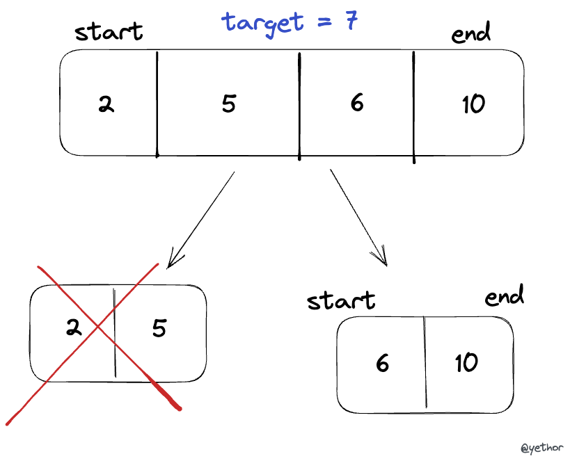

## Concept  



- Binary search is one of the searching algorithms that works on the *Divide and Conquer Approach* (divide a big problem to small sub problems) 
- The main concept is to divide an array into 2 parts, take an appropriate one and keep searching
  1. If starting index is greater than ending index, return `false` 
  2. Caculate the middle index
  3. Compare the value of middle element with target `x`. If they're equal, return `true`
  4. If middle element is greater than target `x`, make ending index = `middle_index - 1`. If it is smaller than target `x`, make starting index = `middle_index + 1` 
  5. repeat step 1    
- It is used to search an element in a sorted array


## Implementation and Complexity 

It can be implemented in two ways: recursive and iterative. Space complexity will be measured based on an auxiliary space.

### Recursive Way 

```javascript
const recursiveFunc = (arr, x, start, end) => {
  if(end < start) return false;

  let mid = Math.floor((start + end) / 2);

  if (arr[mid] === x) return true;

  if(arr[mid] > x) {
    return recursiveFunc(arr, x, start, mid - 1);
  } else {
    return recursiveFunc(arr, x, mid + 1, end);
  }
}
```

**Time complexity is `O(log N)`**
  - The worst case is when the searching reaches to the deepest level of the tree. 
    - `x` is the largest number
    - `x` is the smallest number
    - No `x` is found 
  - In the worst case, the searching steps happens `O(log N)` times since it always divide the array into two parts to search the element


**Space complexity is `O(log N)` or `O(1)`.** It depends on whether the compiler provides *Tail Call Optimization* 
  - Tail call optimization would discard the caller frame and replace the call with a jump. So if it is supported, space complexity is `O(1)`
  - If TCO is not supported, `O(log N)` calls would be stacked in memory in worst case. So the space complexity is `O(log N)` 
  - Only [Safari(Webkit) supports TCO](https://webkit.org/blog/6240/ecmascript-6-proper-tail-calls-in-webkit/) using *ShadowChicken*, others don't
  
### Iterative Way 

```javascript
const iterativeFunc = (arr, x) => {
  let start = 0;
  let end = arr.length - 1;

  while (start <= end) {
    let mid = Math.floor((start + end) / 2);

    if (arr[mid] === x) {
      return true;
    } else if (arr[mid] < x) {
      start = mid + 1;
    } else {
      end = mid - 1;
    }
  }

  return false;
}
```

**Time complexity is `O(log N)`** for the same reasons described in recursive way.

**Space complexity is `O(1)`**
  - We only needs two space(starting index, ending index) regardless of how large the input data is
