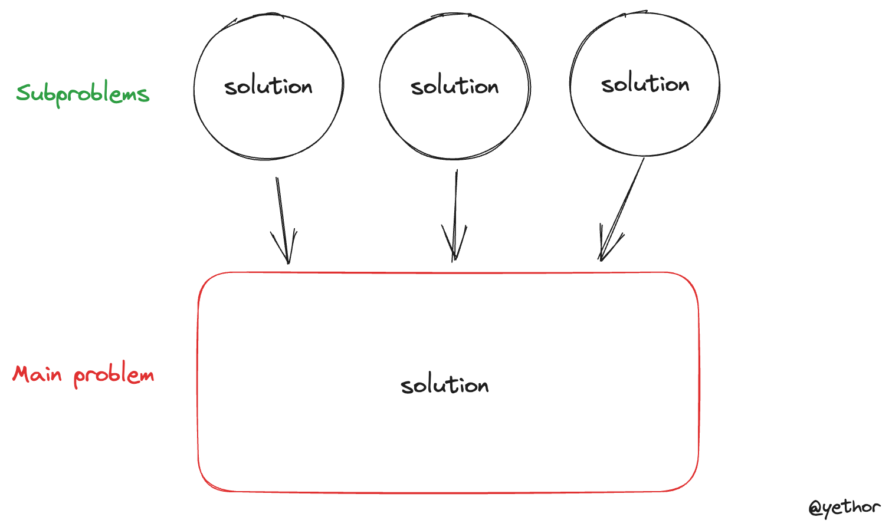

## Concept  


**Dynamic Programming** is more than an algorithm, it's an optimization technique over plain recursion problems. It breaks down the main problem to the smaller subproblems, and stores the partial solutions, reuses them when they needed to solve the main problem. Since there is no recursive calls, it saves memory usage caused by the call stack. Also the time complexity becomes polynomial because it simply look up the table(array, object) that stores solutions of subproblems.




## DP optimizes recursion

The following code is an implementation of the [Fibonacci](https://en.wikipedia.org/wiki/Fibonacci_sequence) problem using recursion and dynamic programming approaches respectively.

```typescript
// Recursion
function fibo(n:number):number {
  if (n <= 1) {
    return n;
  }

  return fibo(n - 1) + fibo(n - 2);
}

// Dynamic Programming
function fibo(n:number):number {
  const f = [];
  
  f[0] = 0;
  f[1] = 1;

  for(let i = 2; i <= n; i++) {
    f[i] = f[i - 1] + f[i - 2];
  }

  return f[n];
}
```

The solution using recursion have to call and execute itself until `n` becomes 1. Since it calls itself `2^n` times, it has exponential time complexity, `O(2^n)`. On the other hand, the solution using dynamic programming solve subproblems and save the partial solution iteratively. So the time complexity becomes a polynomial, `O(n)`. This is the one of examples that dynamic programming optimizes recursion problems.


## What can be solved by dynamic programming approach?

Not all recursive problems can be solved by dynamic programming. There are two necessary conditions.

### 1. Overlapping Subproblems

When the solution to the same subproblem is needed more than once to solve the main problem, we say the problem has overlapping subproblems. In the previously explained Fibonacci problem, the answer of `f(3)` is needed when you get the answer for `f(4)` and `f(5)`. 

In other words, a binary search problem can't be solved by dynamic programming since all of the subproblems has an unique array to find an answer. So it uses divide and conquer technique.

### 2. Optimal Substructure

When the optimal solutions to its subproblem can be used to obtain an optimal solution to the main problem, we say the problem has optimal substructure. In other words, the overall optimal solution can be obtained by putting optimal solutions of subproblems together.

For example, let's say there is a problem that finds the shortest path from `A` to `C`. 


The shortest path `A -> C` can be obtained by using the shortest path of `A -> B` and `B -> C` 


## Summary

Dynamic Programming is an optimization technique for recursion problems that has two properties, overlapping subproblem and optimal substructure. The main concept is breaking down the problem into smaller ones, and store the answers and reuses them to get a final solution. 