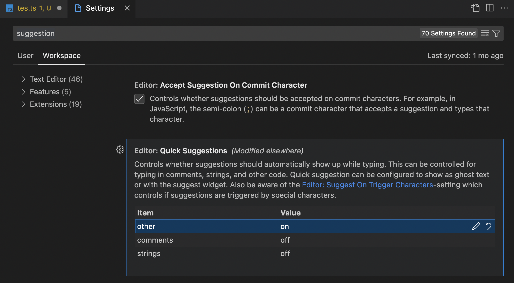
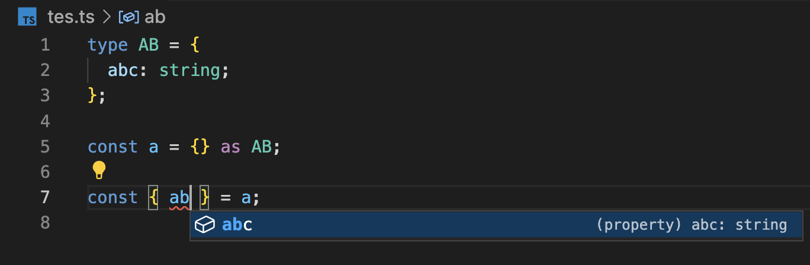

모처럼 새로 산 맥북을 가지고 즐겁게 개발환경을 세팅하던 날이었다.
평소에 작업 중인 타입스크립트 기반의 프로젝트를 pull해서 작업하려는데, 타입 자동완성 추천이 영 시원치 않았다.

예를 들어 아래 예시처럼 `js≤≥.`을 통해 프로퍼티에 접근하려고 할 때는 프로퍼티 값이 자동완성되는데, 객체를 구조 분해 할당하려 할 때는 자동 완성 기능이 동작하지 않았다.

```ts
type A = {
  name: string;
};

const a: A = {
  name: "abc",
};

// 자동완성 추천 기능 동작함
a.name;

// 자동완성 추천 기능 동작하지 않음
const { name } = a;
```

엄한 것들을 의심하며 삽질을 한 결과, VS Code 설정에서 Quick Suggestion이 전부 off로 설정되어있는 것을 발견했다.
아래처럼 `bash≤≥ other : "on"`을 해주니, 정상적으로 자동 완성 추천 기능이 동작하기 시작했다.

<figure>
  
  <figcaption align = "center">VS Code 설정</figcaption>
</figure>

<figure>
  
  <figcaption align = "center">구조 분해 할당시에도 정상적으로 자동완성되는 모습</figcaption>
</figure>

앞으로는 이런 삽질을 반복하지 말고, VS Code 설정을 따로 github 계정에 연동시켜서 한번에 싱크시키는 방법을 시도해봐야겠다.

오늘의 삽질 끝.
