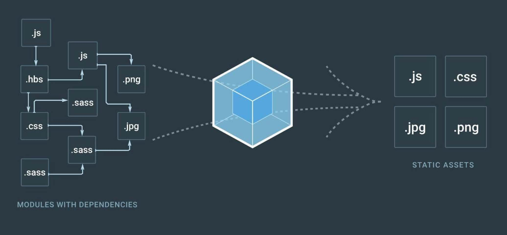

웹팩은 최신 자바스크립트 어플리케이션을 위한 정적 모듈 번들러(static module bundler)다. 조금 더 풀어서 쓰자면, 하나 이상의 엔트리 포인트로부터 의존성 그래프를 그리면서 프로젝트에서 필요로 하는 모든 모듈을 하나 이상의 번들로 묶어낸다는 뜻이다. 그렇게 나온 번들은 static한 컨텐츠로서 웹에 서빙된다. 소스 코드 관점에서는 `src` 폴더 안에 수많은 코드 파일들이 존재하겠지만, 사용자 입장에서는 `bundle.js` 같은 하나의 번들 파일만을 브라우저에서 다운받아 실행하게 되는 것이다.

<figure>
  
  <figcaption align = "center">Webpack 개요(https://webpack.js.org)</figcaption>
</figure>

하나 이상의 엔트리 포인트에서 의존성 그래프를 그린다고 했는데, 여기서 의존성이라는 것은 한 파일이 다른 파일에 의존하는 것을 의미한다. 예를 들어 `test.js` 에서 `util.js`에 있는 함수를 쓴다고 하자. 그러면 `test.js`는 `util.js`에 대한 의존성을 가지고 있는 것이다. 이것은 비단 js 파일에만 국한되는 것이 아니고 이미지나 웹 폰트같은 코드 외적인 에셋에도 적용된다. 웹팩 설정 파일을 보면 엔트리 포인트(entry point)라는 필드가 있는데, 웹팩은 여기서부터 프로젝트가 필요로 하는 모든 모듈을 번들 파일에 담을 수 있도록 재귀적으로 의존성 그래프를 그려나간다. 그런 다음 이들을 하나 혹은 그 이상의 번들 파일로 묶고, 브라우저에서는 이 번들 파일만을 로드하게 되는 것이다.

웹팩 4.0.0 버전 이후로 더이상 설정 파일은 필수가 아니지만, 각 프로젝트 니즈에 커스터마이징을 하기 좋아서 여전히 많은 프로젝트에서 웹팩 설정 파일을 사용하고 있다. 나도 항상 모든 프로젝트 별로 웹팩 설정 파일을 따로 관리하고 있다.

웹팩을 이해하려면 엔트리, 아웃풋, 로더, 플러그인, 모드, 브라우저 호환성에 대한 기본적인 개념을 아는 것이 좋다.

## 엔트리 (Entry)

앞서 언급했지만, 엔트리 포인트는 웹팩이 내부적으로 의존성 그래프를 그리기 위한 시작점이다. 엔트리 포인트를 `index.js` 라고 하자. `index.js`가 모듈 A를 쓰고, 모듈 A가 모듈 B를 쓰고, 모듈 B가 모듈 C를 쓰면, `index.js` 입장에서는 직접적으로는 A를 그리고 간접적으로는 B,C를 사용하는 셈이다. 웹팩은 이런 흐름을 따라 직간접적으로 사용하는 모듈들의 의존성 그래프를 엔트리 포인트로부터 그려나가기 시작하고, 필요한 모든 것들을 번들 파일로 묶어내는 것이다.
이 값은 따로 설정하지 않는다면 `./src/index.js`로 기본값이 설정된다. ts를 쓰거나 다른 이름의 파일을 시작점으로 쓴다면 이 설정값을 바꿔야할 것이다.
엔트리 포인트는 다음처럼 여러개 존재할 수도 있다.

```javascript
// webpack.config.js

entry: {
  home: './home.js',
  about: './about.js',
  contact: './contact.js',
}
```

웹팩 공식 문서에서 가이드하는 한가지 룰이 있는데, 바로 HTML 페이지 하나당 하나의 엔트리 포인트를 사용하는 것이다. 즉, SPA(Single Page Application)에서는 하나의 엔트리 포인트만을, MPA에서는 여러개의 엔트리 포인트를 사용한다. 엔트리 포인트로부터 번들 파일 결과물이 이어지는 것을 생각하면 당연한 이야기기도 하다.

## 아웃풋 (Output)

만들어진 번들 파일을 어디에 어떤 이름으로 저장할지 설정하는 값이다. 기본 값은 `./dist/main.js`이므로, `webpack` 명령어를 실행하면 dist 폴더에 `main.js` 파일이 만들어지는 것을 볼 수 있을 것이다.

```javascript
// webpack.config.js

// 웹팩 빌드시 dist/my-ouput-bundle.js 번들 파일 생성
output: {
  path: path.resolve(__dirname, "dist");
  filename: "my-ouput-bundle.js";
}
```

## 로더 (Loader)

웹팩 그 자체로는 오직 자바스크립트와 JSON 파일만을 인식할 수 있다. 앞서 웹팩을 "최신 자바스크립트 어플리케이션"을 위한 정적 모듈 번들러라고 소개했으니, 이상할 것이 없다. 하지만 프로젝트를 진행하다보면 타입스크립트를 쓸 수도 있고, 이미지나 css 파일을 쓸 수도 있다. 이 때 웹팩이 이런 여러 타입의 파일을 인식하고 다룰 수 있게 해주는 것이 로더다. 알맞은 로더가 적용되면 의존성 그래프에 추가할 수 있는 유효한 모듈로 변환된다.

로더를 설정할 때 필요한 필드로는 `test`와 `use`가 있다. `test`는 어떤 파일을 변환할지, `use`는 파일을 변환하기 위해 어떤 로더를 쓸지에 대한 값이다.

```javascript
// webpack.config.js

module: {
  rules: [
    {
      test: /\.txt$/,
      use: 'raw-loader,
    }
  ]
}
```

위 파일을 예시로 들어보자. 저 설정값은 웹팩이 엔트리 포인트로부터 의존성 그래프를 그리는 과정에서, 파일명이 `.txt` 로 끝나는 파일을 만날 때마다 `raw-loader`를 적용해 웹팩이 다룰 수 있는 모듈로 변환하고 의존성 그래프에 추가하겠다는 뜻이다. `raw-loader` 같은 로더는 npm이나 yarn같은 패키지 매니저를 통해 설치할 수 있다.

## 플러그인 (Plugins)

로더가 특정 타입의 모듈을 변환하는 역할이라면, 플러그인은 번들 최적화, 에셋 관리, 환경 변수 주입같은 보다 광범위한 작업을 수행하는 역할을 한다. 플러그인을 쓰려면 우선 해당 플러그인을 npm같은 패키지매니저로 설치한 다음, 웹팩 설정 파일에서 `require()`로 불러와 `plugins` 설정에 배열 형태로 추가한다.

```javascript
// webpack.config.js

const HtmlWebpackPlugin = require('html-webpack-plugin');

module.exports ={
  ...,
  plugins: [
    new HtmlWebpackPlugin({ template: './src/index.html'})
  ]
}
```

대부분의 플러그인은 저마다의 방식으로 옵션을 적용해 커스터마이즈해서 사용할 수 있고(자세한 건 각 플러그인 관련 문서를 참고할 것), 목적에 따라 여러번 쓰일 수도 있기 때문에 `new` 연산자로 새로운 인스턴스를 만들어주어야 한다.

## 모드 (Mode)

빌드 환경 값을 설정할 수 있다. 이 값을 `development`, `production`, `none` 등으로 설정함으로써, 웹팩 빌드를 각 환경에 맞게 최적화할 수 있다. 기본값은 `production`이다.

```javascript
mode: 'production',
```

## 브라우저 호환성 (Browser Compatibility)

웹팩은 모든 ES5 호환 브라우저를 지원한다. IE 8 이하는 지원하지 않는다. 어차피 IE 11조차도 2022년 6월에 공식 지원 종료가 됐으니, 크게 문제가 될 일은 없을 것이다. 웹팩은 `import()`와 `require.ensure()`을 쓸 때 `Promise`를 필요로 하므로, 구형 브라우저를 지원해야하는 상황이라면 폴리필이 필요하다는 점을 명심하자.

웹팩을 이해하는 데에 있어서 필수적인 개념들을 간단히 정리해보았다. 웹팩은 워낙 공식 문서도 잘 정리되어있고, 좋은 강의 자료나 아티클도 많아서 공부하는 데에 크게 어려운 점은 없다. 다만 항상 쓰던 설정만 쓰거나, 프로젝트 셋업때만 웹팩을 보다보니 종종 기억이 가물가물해질 때도 있다. 시간날 때 종종 웹팩 문서를 더 상세히 보면서 정리하는 시간을 가져봐야겠다.
